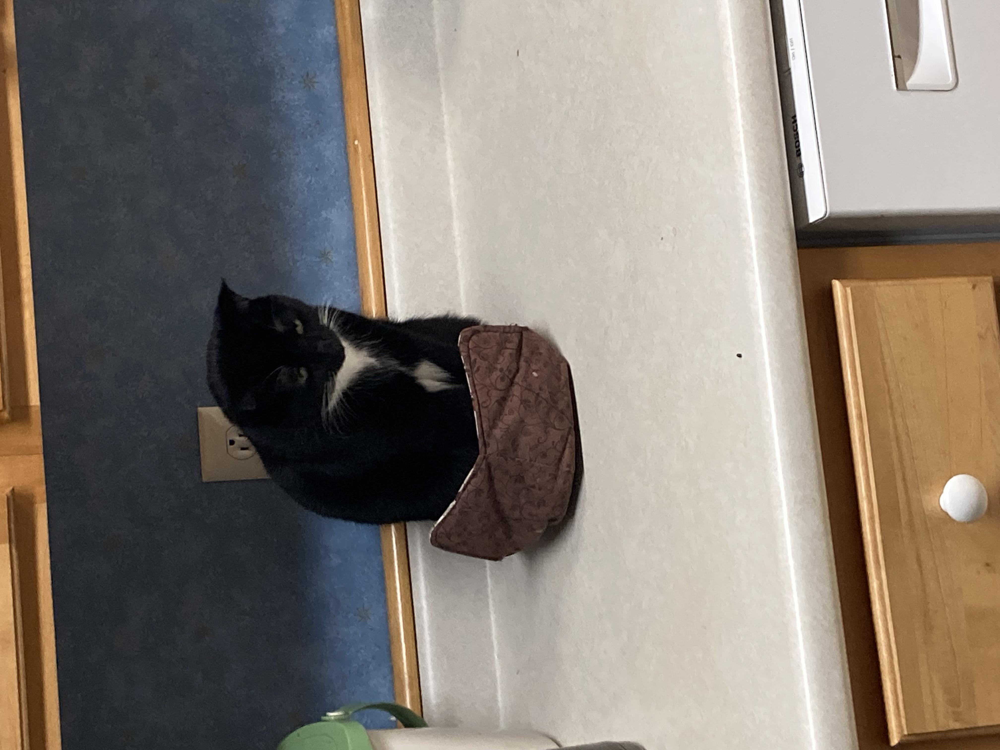

# Experience and Skills
* 15 years of experience kicking rocks to keep them going while walking
* Professional at sliding, some examples include
    + Socks on wood floox
    + Ice on pavement (somewhat dangerous)
    + Water-park slides
    + Playground Slides
* Can Run under a 10 minute mil
    
# Fun Facts
* I was Born in Ithaca!
* I really like crucnchy snow under my feet
* Currently trying to learn about country capitals and major cities of the world

## **A picture of my cat!**
```{r, fig.align="center",out.width = "40%",out.height="40%", out.extra='angle=270',eval=TRUE, echo=FALSE}

```
# Favorite Equation
My Favorite equation is 
$$
e ^ {i\pi} + 1 = 0
$$
I like this equation because the derivation is relatively simple to comprehend and it is really cool to see some of th most interesting numbers such as e, i, pi, 0 and 1 all incorporated into the same equation.
